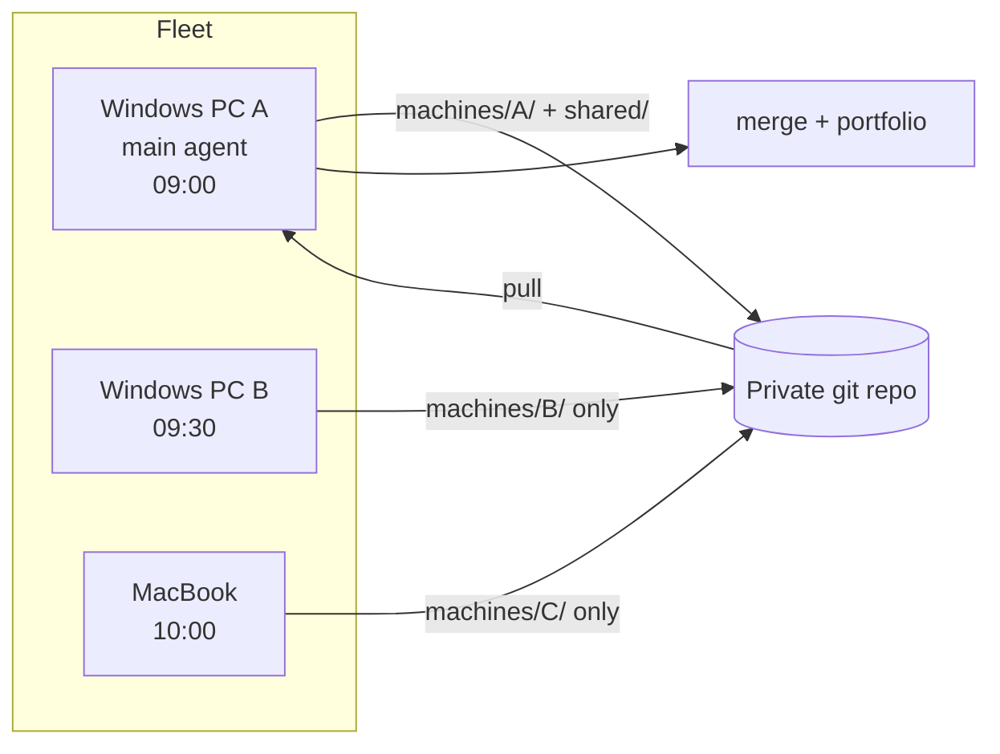
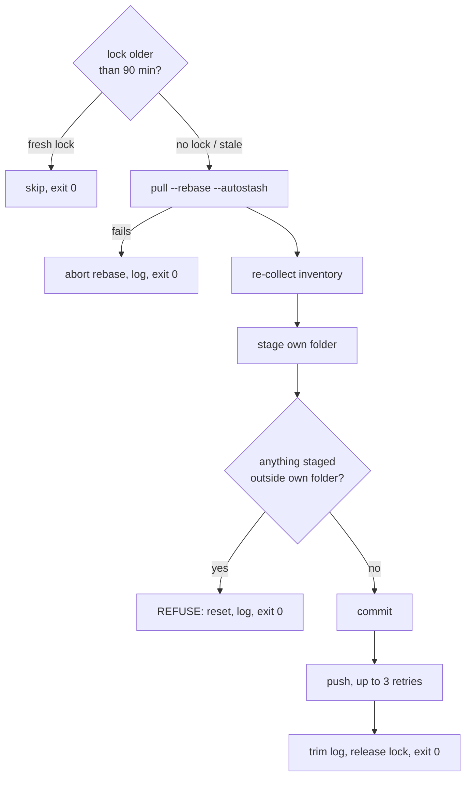
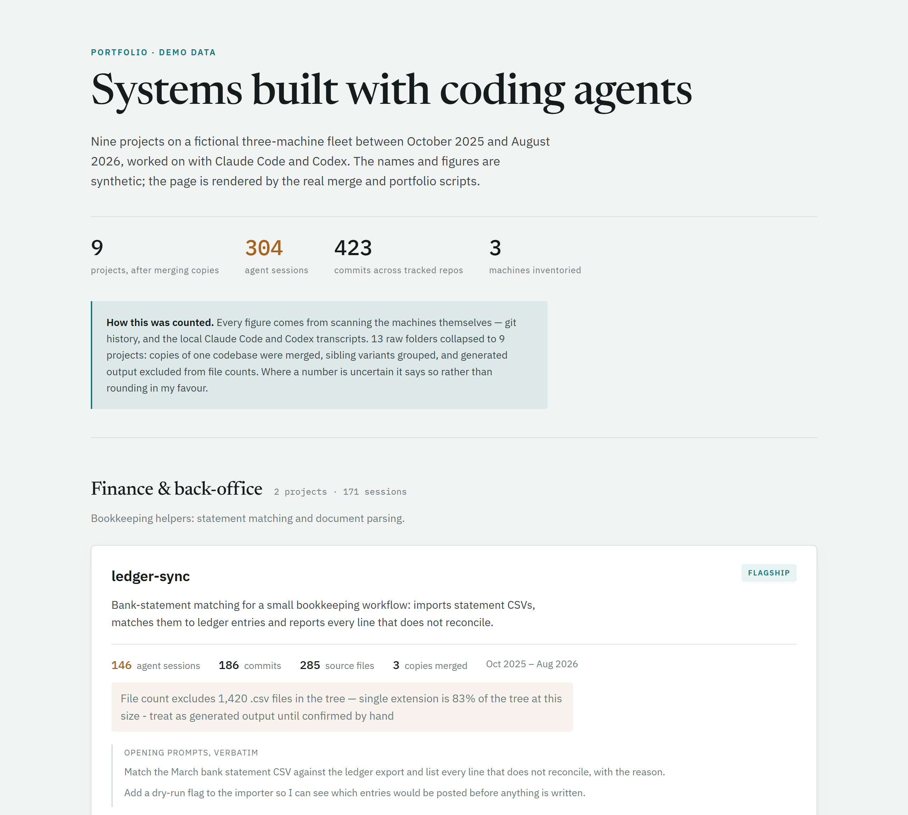
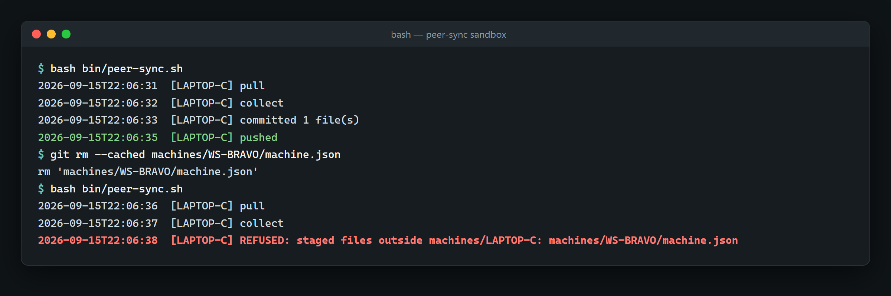
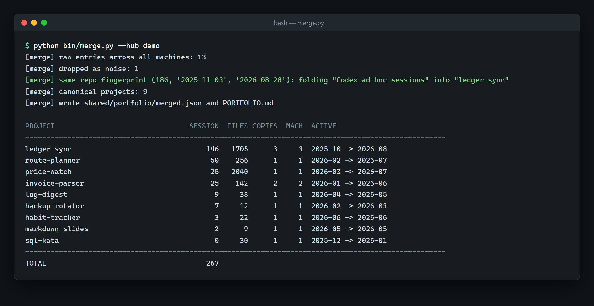

# Agent Fleet Hub

A small, self-running coordination hub for one developer's machines. It inventories every
project and coding-agent session on each machine, merges duplicates into one honest list, and
keeps everything on GitHub under a single identity.

**since Sep 2026, active · 27 commits · Python · PowerShell · Bash · code: private**
## The problem

I build most of my software with coding agents (Claude Code and Codex), on two Windows PCs and a
MacBook. After a year, three things had gone wrong:

- **Work drifted into copies**: backup folders, old-PC migrations, downloads and agent
  worktrees. Nobody could say how many projects there really were.
- **Agent sessions were invisible.** Almost 2,000 sessions sat in local transcript folders, and
  much of that work had no commit history at all.
- **Commit identity was split.** Commits had been authored under an address tied to a second,
  dormant GitHub account, or under machine-generated addresses. Hundreds counted toward the
  wrong profile, or toward none.

## What it does

- **Inventories each machine**: projects, languages, git history, and Claude Code and Codex
  sessions bound to the project they ran in. Metadata only, with secrets and long digit runs
  redacted on the way in.
- **Merges across machines.** At the last full merge, 57 raw folder entries became 22 real
  projects, with every agent session bound to the project it ran in.
- **Renders a portfolio page** where every number is computed and every doubtful number carries
  its caveat.
- **Syncs itself.** Each machine refreshes and pushes its own inventory daily, unattended.
- **Puts repos under one identity before their first push**, and strips oversized files from
  history when needed. One repository went from 710 MB to 158 MB.
- **Keeps remote access alive** with a watchdog that restarts a hung remote-desktop service.

## How it works

Every machine holds a clone of one private git repository. Each machine writes only its own
folder, so two machines never touch the same bytes.

One scheduled cycle on a peer:

## Engineering notes

- **The invariant is enforced in code.** If anything outside the machine's own folder is
  staged, the sync resets and refuses. It fired on its first real run: it caught another
  machine's files that were staged for removal.
- **Built for a scheduler.** Each run has a lock that goes stale after 90 minutes, a log capped
  at 500 lines, and an exit code of 0 whatever happens. Runs are staggered so machines never
  rebase at once. Tasks run only while the user is logged in, by choice: the alternative is
  storing a password in a scheduled task.
- **Merge, group, relate.** Copies of one codebase merge: sessions add up, but file counts take
  the largest copy and are never summed. Sibling variants group. Projects in the same domain are
  only cross-linked. Git evidence beats folder names: nine "separate" folders turned out to be
  runs of one repository.
- **Generated output is not counted as code.** One project had 3,507 of 3,655 files as captured
  HTML, with 148 real source files; the page says so.
- **Rewrite with a backup, and verify it.** The re-author tool refuses repos that already have a
  GitHub remote or linked worktrees. It saves uncommitted work and rewrites a mirror. It then
  checks four things: the same commit count, the same tip tree, the same per-day commit pattern,
  and a single author. Only then does it push and move the live branch with a soft reset.
- **Fixed in real use.** A laptop whose hostname followed the network appeared as two machines;
  an alias map folds them back into one. An escaping bug had turned `\a` in a Windows path into
  a BEL character. Counting commits over all refs had doubled one repo's history, so commits are
  now counted from HEAD.

## How it is verified

- Identity resolution was tested with a real commit: one authored under the old address, which
  GitHub's API credited to the secondary account.
- The bridge counted as working only after three machines pushed on their own schedule and the
  main machine pulled all three cleanly.
- Every rewrite prints its checks and GitHub's linked or unlinked count per commit.
- The public profile was re-checked from a logged-out browser.

## Stack

Python 3 (standard library), Windows PowerShell 5.1, Bash (3.2-compatible), git, GitHub CLI,
git-filter-repo, Windows Task Scheduler, launchd, RustDesk, Claude Code, Codex.

## Screenshots

_The real code running on synthetic data. No client data appears anywhere._

*The hub's real merge and portfolio scripts rendering a synthetic three-machine fleet: figures header, then a flagship card that folds three copies into one project and keeps generated files out of the source count.*

*The real peer-sync script in a local sandbox: one normal pull-collect-commit-push cycle, then a refused run because another machine's file was staged.*

*merge.py output on synthetic data: a Codex scratch folder is recognised as the same repository by its commit fingerprint and folded into ledger-sync.*

## Access

The code is private. To request a walkthrough or read access, open an issue in this repository
or email eazamat360@gmail.com.
